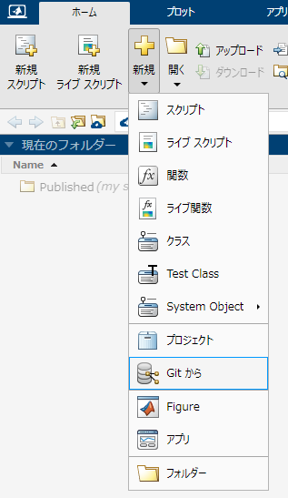
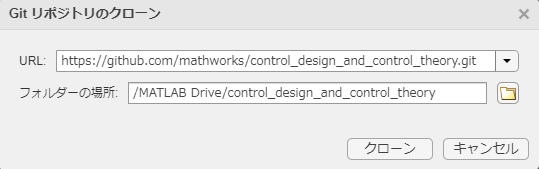
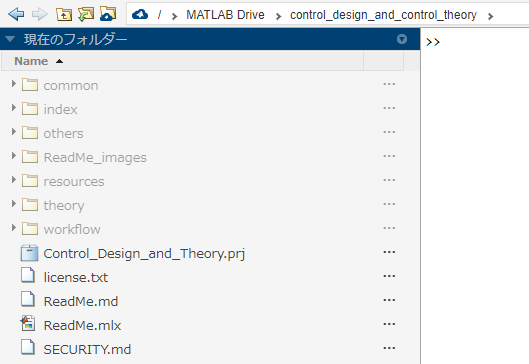
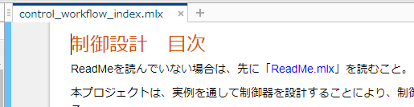
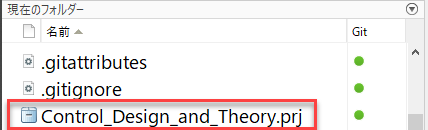

# 実践的な制御設計とその理論
# 概要


本コンテンツは、実例を通して制御器を設計することを紹介し、制御設計手法及び理論を効率よく学べるようにしたコンテンツである。各例題を読みながらモデルやスクリプトを順番に実行し、結果を逐次確認することができる。


# 必要なツールボックス

   -  MATLAB® 
   -  Simulink® 
   -  Stateflow® 
   -  Control System Toolbox™ 
   -  Simulink Control Design™ 

# コンテンツの使い方（オンライン）


※この方法で起動すると、ローカルPCにMATLABをインストールせずにコンテンツを読むことができる。


### 1. クローン用のリンクをコピーする


以下のWebリンクをコピーする。


https://github.com/mathworks/control_design_and_control_theory.git


### 2. MATLAB Onlineを起動する


オンラインを使用可能なライセンスを持っている場合は、以下からMATLAB Online を起動できる。


[MATLAB (mathworks.com)](https://matlab.mathworks.com/)


### 3. Git からクローンする


以下のように、「ホーム」タブの「新規」「Git から」をクリックする。





URLに1.でコピーしたリンクを貼り付け、フォルダーの場所には以下のように記入する。


記入後、「クローン」をクリックする。





クローンが実行され、完了後は以下のようにファイル、フォルダが生成される。





### 4. プロジェクトを実行する


「Control_Design_and_Theory.prj」を実行する。


目次ファイル「control_workflow_index.mlx」が起動する。この資料を読み進め、リンク先のファイルを開いて読み、モデル実行していく。





# コンテンツの使い方（ローカルPC）
### 1. プロジェクトを起動する


MATLABを起動し、現在のフォルダーに「Control_Design_and_Theory.prj」ファイルが存在するフォルダーを指定する。


「Control_Design_and_Theory.prj」をダブルクリックして起動する。





### 2. 目次ファイルを読み進める


プロジェクトを起動すると、自動的に目次ファイル「control_workflow_index.mlx」が起動する。この資料を読み進め、リンク先のファイルを開いて読み、モデル実行していく。


# ライブスクリプトの使い方


本コンテンツでは、ライブスクリプトをベースに説明を行っている。本コンテンツを読み進めるのに当たって必要なライブスクリプトの操作方法について、本セクションにて説明する。


### セクション


ライブスクリプトには、セクション区切りが存在している。これは、ファイルの部分ごとに順番に実行し、一つずつ結果を確かめながら進むことができるようにするためである。


選択されたセクションは以下のように青色になっている。


この状態で、キーボードで"Ctrl + Enter"を入力すると、そのセクションのみを実行することができる。また、"Ctrl + Shift + Enter"で、セクションを実行し、かつその次のセクションを選択状態にすることができる。


### コントロール


一部のライブスクリプトでは、「コントロール」という機能を用いて、ユーザーフレンドリーな実行環境を実現させている。


例えば以下のセクションでは、「編集フィールド」を用いて、入力された数値を表示するという操作を自動化している。試しに、編集フィールド内の数値を変更し、"Enter"を入力、または別の場所にカーソルを移動させてみること。セクションが自動的に実行され、表示される数字が変化することがわかる。


```matlab:Code
disp(1);
```


```text:Output
     1
```

# 目次


コンテンツの目次について、以下に記載する。


   -  はじめに 
   -  UAVのホバリング Part 1: PID制御とは 
   -  UAVのホバリング Part 2: 積分器、微分器の拡張 
   -  UAVのホバリング Part 3: ゲインチューニング 
   -  離散化とマイコン実装について 
   -  PID設計のガイド 

# Note


This content is useful for self-learning of control design. You can learn practical control design method and control theory in a short time. This content is made of live scripts and Simulink models. Thus, you can easily run and check the control algorithms.


For now, this content is Japanese only. 


  


*Copyright 2021 The MathWorks, Inc.*


